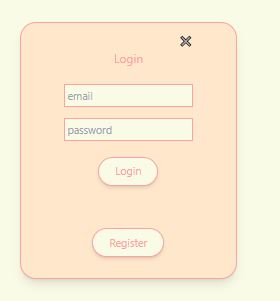
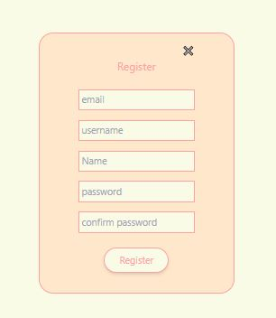
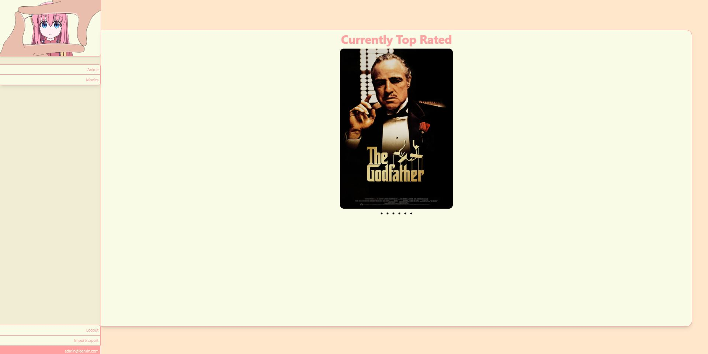
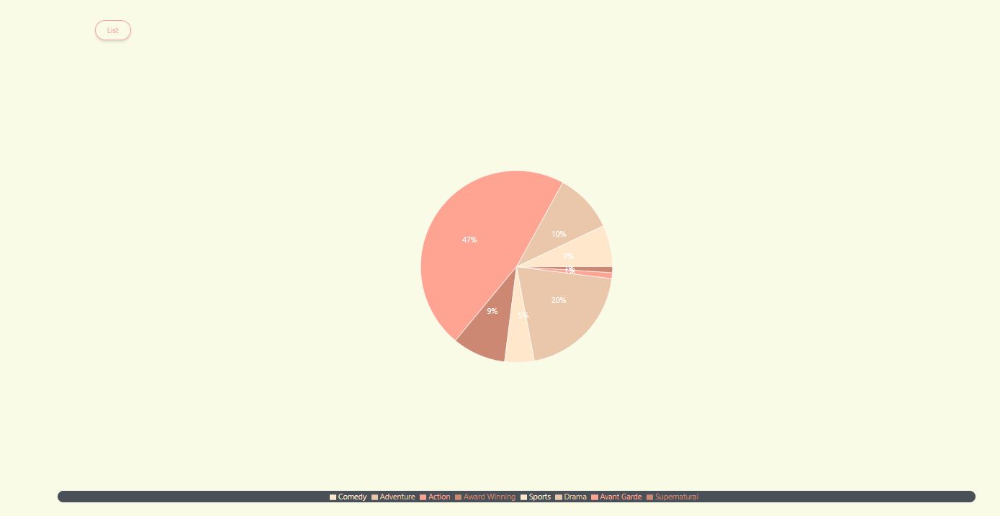
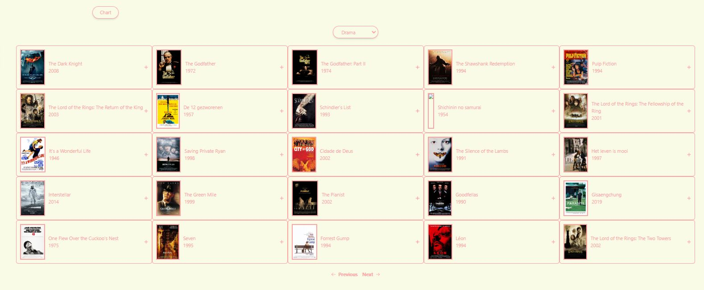
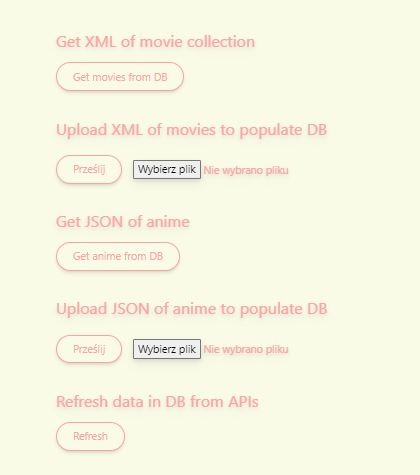
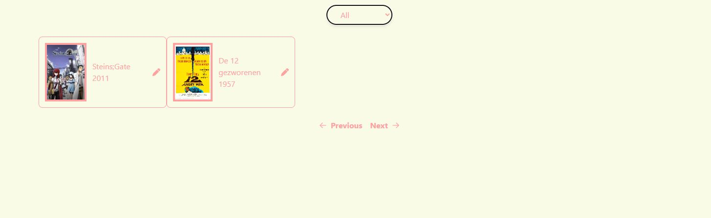
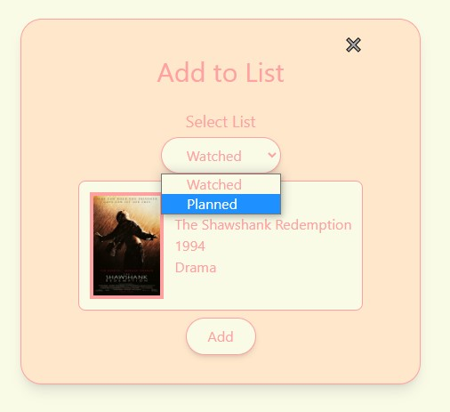

# aspnet-react-mongo-docker-stack

This Docker stack is a simple example of how to run a ASP.NET Core Web API, React, and MongoDB in Docker containers. The stack is composed of the following components:
- ASP.NET Core Web API 6 as the backend
- React as the frontend
- MongoDB as the database
- Additional MongoDB container for seeding the database with data

It also includes the following features:
- Authentication and authorization with JWT token
- Admin panel for managing exporting/importing data from/to database to/from JSON/XML file
- Charts for visualizing data
- List of movies/anime filtered by genre
- Data is obtained from external APIs. You can find the documentations for them here: https://rapidapi.com/SAdrian/api/moviesdatabase/details and https://docs.api.jikan.moe/
- List of watched/planned to watch movies/anime for each user, with the ability to add/remove them from the list and change them to the opposite list

## Installation
The instructions assume that you have already installed Docker and Docker Compose.

In order to get started be sure to clone this project onto your Docker Host. Create a directory on your host. Please note that the demo webservices will inherit the name from the directory you create. If you create a folder named test. Then the services will all be named test-web, test-redis, test-lb.

### Clone the project
```
git clone https://github.com/SaesongMS/aspnet-react-mongo-docker-stack.git
```

### Build and run the project
```
docker-compose up --build
```

After the build is complete, you should be able to access the application at http://localhost:3000.

Database contains two created users:
- username: admin@admin.com, password: admin - admin user
- username: a@a.a, password: 123456 - regular user

## Views of the application

||
|:--:|
|*Login page*|

||
|:--:|
|*Register page*|

||
|:--:|
|*Home page*|

||
|:--:|
|*Genre chart*|

||
|:--:|
|*List of movies by genre*|

||
|:--:|
|*Admin panel*|

||
|:--:|
|*List of watched/planned*|

||
|:--:|
|*Add to list*|

||
|:--:|
|*Edit element in list*|

This project was created and maintained by [70masz](https://github.com/70masz) and [SaesonMS](https://github.com/SaesongMS)
